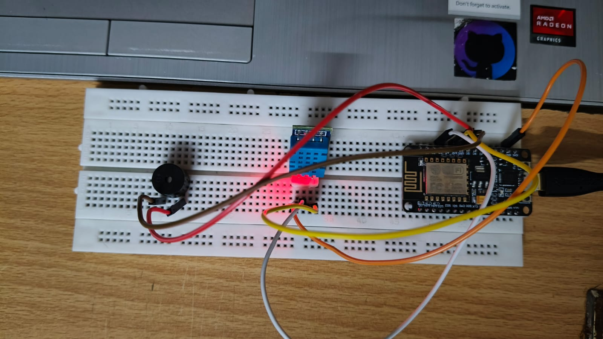
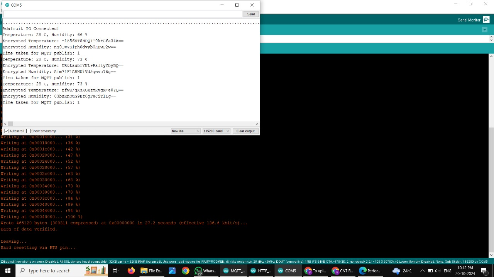

# Encrypted Sensor Data Transmission using MQTT

This project demonstrates secure and efficient IoT sensor data transmission using the **MQTT protocol integrated with AES encryption**. The system collects real-time temperature and humidity data from a DHT11 sensor connected to an ESP8266 microcontroller and publishes it to the Adafruit IO cloud with end-to-end encryption.

---

## 📝 Abstract

In the context of IoT environments, secure communication is crucial. This project explores how lightweight encryption using **AES (Advanced Encryption Standard)** can be integrated with **MQTT**, a lightweight publish/subscribe messaging protocol, to enhance the confidentiality and integrity of sensor data. The encrypted data is transmitted from an ESP8266 to **Adafruit IO**, visualized via gauges, and monitored using Wireshark to ensure secure transmission.

---

## 🔧 Features

- Collect real-time temperature and humidity from a DHT11 sensor
- Encrypt sensor data using AES algorithm
- Transmit encrypted data to cloud via MQTT
- Display live data on **Adafruit IO Dashboard**
- Monitor encrypted traffic using **Wireshark**
- Low latency and optimized performance for constrained IoT devices

---

## 🔩 Hardware Setup

Components used:
- ESP8266 NodeMCU
- DHT11 Sensor
- Breadboard and jumper wires
- Optional: buzzer for alert indication

---

## 📡 Cloud Dashboard

- Live temperature and humidity displayed via gauges  
- Historical data storage on Adafruit IO feeds  
- Dashboard accessible online through secure login  

---

## 💻 Serial Monitor Output

The encrypted data, along with publishing latency, is displayed in the Arduino Serial Monitor after successful upload.

---

## 🔐 How It Works

1. **Sensor Setup**: DHT11 connected to ESP8266 collects data.
2. **AES Encryption**: Data is encrypted using AESLib before transmission.
3. **MQTT Publishing**: Encrypted data is published to Adafruit IO using PubSubClient.
4. **Cloud Display**: Data is visualized on Adafruit IO.
5. **Wireshark Monitoring**: Verifies data encryption during transmission.

---

## 🛠 Tools & Libraries

- **Arduino IDE**
- **ESP8266WiFi.h**
- **PubSubClient.h** (MQTT)
- **AESLib.h** (Encryption)
- **Adafruit IO Cloud**
- **Wireshark** (Traffic monitoring)

---

## 📂 File Structure

