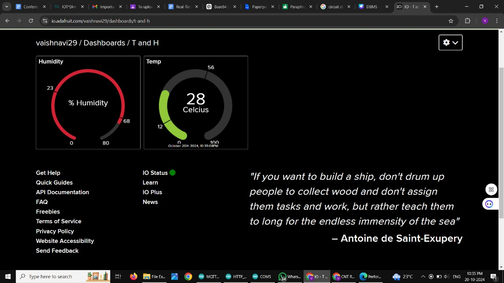

# Encrypted Sensor Data Transmission using MQTT

This project demonstrates secure and efficient IoT sensor data transmission using the **MQTT protocol integrated with AES encryption**. The system collects real-time temperature and humidity data from a DHT11 sensor connected to an ESP8266 microcontroller and publishes it to the Adafruit IO cloud with end-to-end encryption.

---

## 📝 Abstract

In the context of IoT environments, secure communication is crucial. This project explores how lightweight encryption using **AES (Advanced Encryption Standard)** can be integrated with **MQTT**, a lightweight publish/subscribe messaging protocol, to enhance the confidentiality and integrity of sensor data. The encrypted data is transmitted from an ESP8266 to **Adafruit IO**, visualized via gauges, and monitored using Wireshark to ensure secure transmission.

---

## 🔧 Features

- Collect real-time temperature and humidity from a DHT11 sensor
- Encrypt sensor data using AES algorithm
- Transmit encrypted data to cloud via MQTT
- Display live data on **Adafruit IO Dashboard**
- Monitor encrypted traffic using **Wireshark**
- Low latency and optimized performance for constrained IoT devices

---

## 🔩 Hardware Setup

Components used:
- ESP8266 NodeMCU
- DHT11 Sensor
- Breadboard and jumper wires
- Optional: buzzer for alert indication

---

## 📡 Cloud Dashboard

- Live temperature and humidity displayed via gauges  
- Historical data storage on Adafruit IO feeds  
- Dashboard accessible online through secure login  

---

## 💻 Serial Monitor Output

The encrypted data, along with publishing latency, is displayed in the Arduino Serial Monitor after successful upload.

---

## 🔐 How It Works

1. **Sensor Setup**: DHT11 connected to ESP8266 collects data.
2. **AES Encryption**: Data is encrypted using AESLib before transmission.
3. **MQTT Publishing**: Encrypted data is published to Adafruit IO using PubSubClient.
4. **Cloud Display**: Data is visualized on Adafruit IO.
5. **Wireshark Monitoring**: Verifies data encryption during transmission.

## Output on Adafruit IO Dashboard

The live temperature and humidity values, collected from the DHT sensor and transmitted via MQTT, are visualized in real-time on the Adafruit IO dashboard using interactive gauge widgets.

---

## 🛠 Tools & Libraries

- **Arduino IDE**
- **ESP8266WiFi.h**
- **PubSubClient.h** (MQTT)
- **AESLib.h** (Encryption)
- **Adafruit IO Cloud**
- **Wireshark** (Traffic monitoring)

---

## 📂 File Structure

encrypted_sensor_mqtt/
├── encrypted_sensor_mqtt.ino
├── config.h (in .gitignore for secrets)
├── README.md
├── screenshots/
│   ├── hardware_circuit_setup.jpg
│   ├── adafruit_dashboard.jpg
│   ├── serial_monitor_output.jpg
│   └── Adafruit_output.jpg

---

## 🚀 Setup Instructions

1. Install the required Arduino libraries (`AESLib`, `PubSubClient`, `ESP8266WiFi`)
2. Flash the `.ino` code to your ESP8266 via Arduino IDE
3. Configure your Adafruit IO credentials in the code
4. Connect to WiFi and open the Serial Monitor to observe logs
5. Check Adafruit IO dashboard for real-time visual data

---

## 📈 Results

- AES encryption successfully protected sensor data during MQTT transmission.
- Wireshark verified that data remained unreadable during transit.
- Adafruit IO displayed and stored data correctly after decryption.

---

## 👩‍💻 Author

**Vaishnavi Patade**  
B.Tech Computer Engineering (AI), VIT Pune  
GitHub: [vaishnavi-netizen](https://github.com/vaishnavi-netizen)

---

## 📃 License

This project is released under the MIT License.

